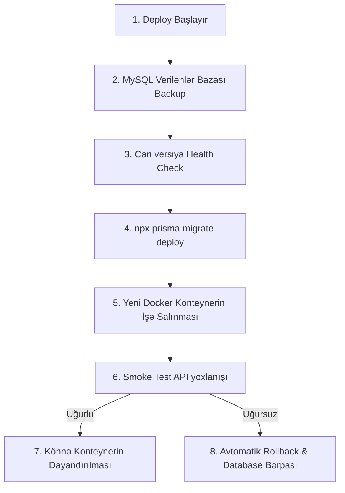

# Discover Karabakh — İstehsalata (Production) Buraxılış və Layihə Analizi Planı

Bu sənəd "Discover Karabakh" platformasının canlıya çıxarılması üçün ən yüksək təhlükəsizlik, dayanıqlılıq, ehtiyat nüsxələmə və fəlakətdən bərpa (Disaster Recovery) standartlarını özündə cəmləşdirən yekun istehsalat planıdır.

---

## 1. Yekun İstehsalat İnfrastrukturu və Arxitekturası

Təqdim etdiyiniz genişləndirilmiş təhlükəsizlik və arxitektura tələbləri layihəni tam mənada **korporativ səviyyəyə (enterprise-ready)** çatdırır:

### Qabaqcıl Növbə (Queue) İdarəetməsi
* **Retry Siyasəti**: Hər bir uğursuz olan tapşırıq (məs. e-poçt və ya SMS göndərilməsi) avtomatik olaraq eksponent gözləmə müddəti ilə 3–5 dəfə yenidən cəhd ediləcək.
* **Dead-Letter Queue (DLQ)**: Tamamilə uğursuz olan və bütün cəhdləri bitən tapşırıqlar (məs. ödəniş yoxlanışı xətaları) araşdırılmaq üçün DLQ-yə köçürüləcək.
* **İdempotentlik (Idempotency)**: Eyni transaksiyanın və ya bildirişin təkrar icrasını önləmək üçün hər bir tapşırığa unikal `idempotencyKey` təyin ediləcək (bazadakı `shipment.idempotencyKey` modelinə bənzər).

### Cloudflare R2 Saxlanma Siyasəti (Prefixes)
* İdarəetməni sadələşdirmək üçün layihədə vahid R2 bucket istifadə olunacaq, lakin daxildə prefikslərə bölünəcək:
  * `public/` (məs. `public/hotels/`, `public/attractions/`): Hamı üçün açıq oxunma statuslu şəkillər.
  * `private/` (məs. `private/documents/`, `private/qr-codes/`): Yalnız backend tərəfindən generasiya edilmiş **Presigned URL (müddəti 10-15 dəqiqə)** vasitəsilə keçid verilən sənədlər.

### Qabaqcıl Auth & Təhlükəsizlik
* **Lockout (Hesabın kilidlənməsi)**: 5 dəfə ardıcıl uğursuz login cəhdindən sonra istifadəçi hesabı müvəqqəti olaraq 15 dəqiqəlik kilidlənəcək (IP və E-poçta görə).
* **Refresh Token Rotasiyası**: Hər refresh token istifadə edildikdə köhnəsi etibarsız sayılacaq və yenisi veriləcək. Bu, oğurlanmış tokenlərin qarşısını alır.
* **Ətraflı Audit Logları**: Qiymət dəyişiklikləri və admin/vendor fəaliyyətlərində yalnız dəyişiklik yox, həm də **IP ünvanı, User-Agent, əvvəlki dəyər (before) və yeni dəyər (after)** loglaşdırılacaq.

---

## 2. Docker Services & Health Checks

Bütün konteynerlərdə (Backend, Worker, Scheduler, Redis) avtomatik sağlamlıq yoxlanışı (healthcheck) olacaq.

```yaml
# docker-compose.yml nümunəsi
services:
  backend:
    image: discoverkarabakh:latest
    healthcheck:
      test: ["CMD", "curl", "-f", "http://localhost:4000/api/v1/health"]
      interval: 30s
      timeout: 10s
      retries: 3
```

---

## 3. Təhlükəsiz Deploy və Miqrasiya Ardıcıllığı

Deploy zamanı məlumat itkisini sıfıra endirmək üçün Coolify/GitHub Actions üzərində aşağıdakı ardıcıllıq tətbiq olunacaq:



---

## 4. Disaster Recovery (Fəlakətdən Bərpa) Planı

| Fəlakət Ssenarisi | Müdafiə və Bərpa Proseduru |
| :--- | :--- |
| **VPS Serverin Sıradan Çıxması** | Coolify konfiqurasiya backup-ları əsasında yeni Hetzner VPS üzərində platforma 15 dəqiqə ərzində sıfırdan ayağa qaldırılır. |
| **Database Region Problemi** | Aiven/RDS üzərində Point-in-Time bərpa ilə son 5 dəqiqəlik vəziyyətə geri dönmə. |
| **Cloudflare R2 Əlçatmazlığı**| R2 üçün çarpaz region replikasiyası (cross-region replication). Qısamüddətli kəsintidə media faylları read-only rejimə keçirilir. |
| **DNS / SSL Problemləri** | Cloudflare DNS idarəetmə panelindən sürətli ehtiyat proxy IP-lərinə yönləndirmə. |

---

## Proposed Changes

Təhlükəsizlik və növbələrin idarə edilməsi üçün dəyişdiriləcək kod strukturları:

### [MODIFY] [package.json](file:///c:/Users/lenovo/Desktop/DISCOVERKARABAKH/back/package.json)
* `express-rate-limit`, `helmet`, `bullmq`, `redis`, `@aws-sdk/client-s3` asılılıqlarını rəsmi olaraq əlavə etmək. Təhlükəsizlik skanları üçün CI/CD alətlərini (npm audit) konfiqurasiya etmək.

### [MODIFY] [redis.client.js](file:///c:/Users/lenovo/Desktop/DISCOVERKARABAKH/back/cache/redis.client.js)
* Redis stub-ı tamamilə silmək, xəta olduqda keşləməni söndürən, lannet/növbə (queues) sisteminə isə xəta atan ağıllı inteqrasiya.

### [MODIFY] [upload.middleware.js](file:///c:/Users/lenovo/Desktop/DISCOVERKARABAKH/back/middlewares/upload.middleware.js)
* Yüklənən faylın kateqoriyasına görə R2 bucket daxilində `public/` və ya `private/` prefikslərini təyin edən multer konfiqurasiyasını yazmaq.

### [MODIFY] [upload.controller.js](file:///c:/Users/lenovo/Desktop/DISCOVERKARABAKH/back/modules/shared/upload/upload.controller.js)
* Pasportlar və faturalar üçün müvəqqəti presigned URL generasiya edən və yalnız şifrələnmiş sorğuları qəbul edən nəzarətçi.

---

## Verification Plan

### Automated Tests
* CI/CD daxilində `lint`, `test` və asılılıqların təhlükəsizlik skanının (`npm audit`) yoxlanılması.
* Redis fallback və BullMQ DLQ (Dead-letter queue) testlərinin işlədilməsi:
  ```powershell
  node back/scratch/test_queues_dlq.js
  ```

### Manual Verification
* Bir neçə dəfə ardıcıl yanlış şifrə daxil edərək **Lockout (hesabın kilidlənməsi)** testinin keçirilməsi.
* Coolify panelindən DB backup faylının yüklənərək başqa lokal bazaya bərpa edilə bilməsinin (Restore test) yoxlanılması.
